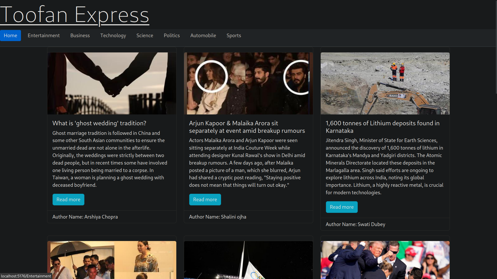
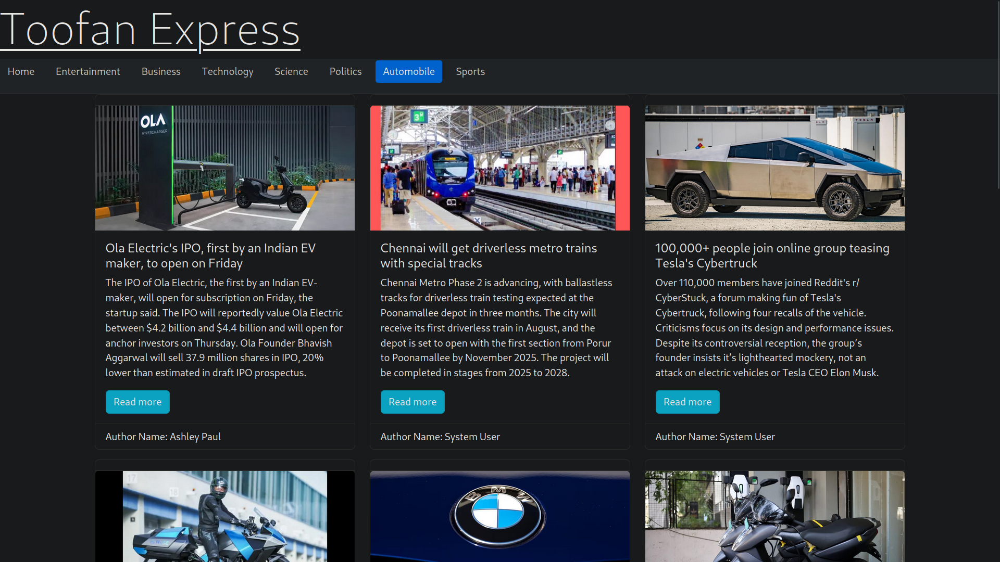
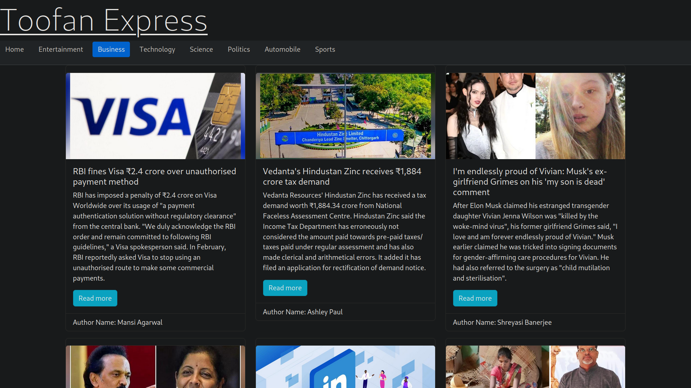
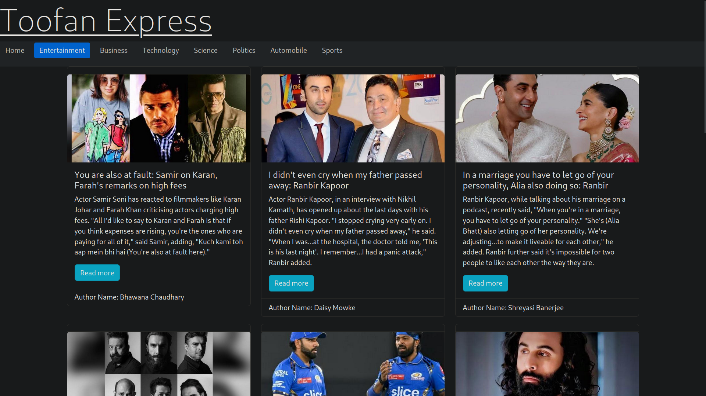
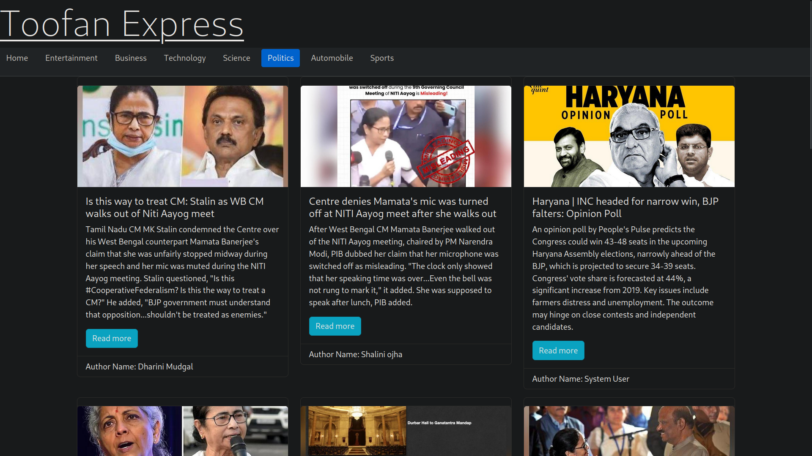
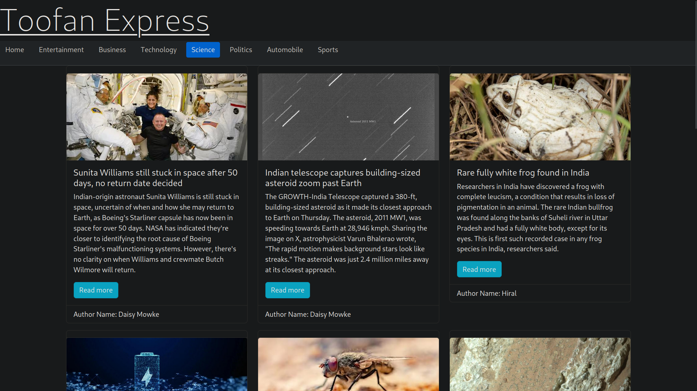
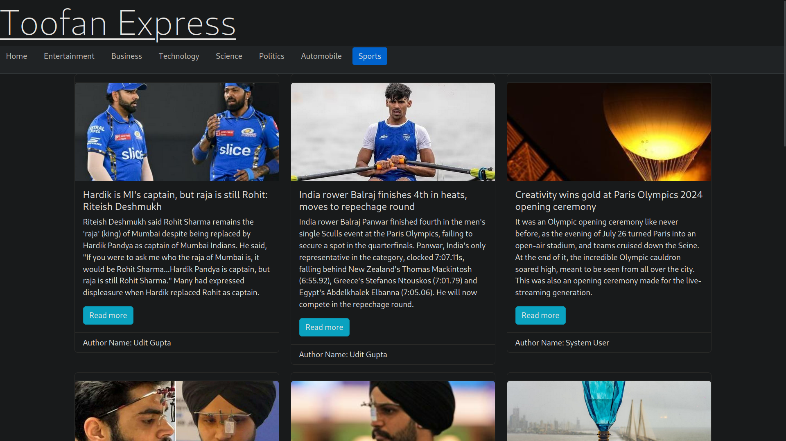
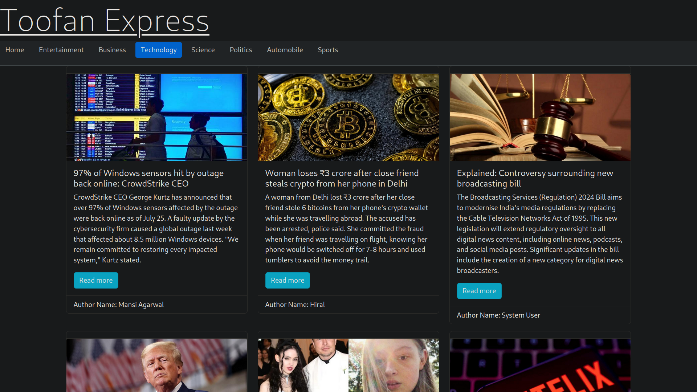

# ToofanExpress

Welcome to the News App! This application provides up-to-date news articles categorized into various topics. Built with React, styled using React-Bootstrap and Bootstrap, and configured with Vite, it offers a modern and responsive user interface.

## Features

- **Home**: Overview of the latest news articles.
- **Entertainment**: News related to movies, music, TV shows, and more.
- **Business**: Latest updates and insights into the business world.
- **Technology**: News on the latest tech trends and innovations.
- **Science**: Discover recent advancements and discoveries in science.
- **Politics**: Updates on political events and developments.
- **Automobile**: Information on the latest in the automobile industry.
- **Sports**: Coverage of recent sports events and scores.

## Technologies Used

- **React**: A JavaScript library for building user interfaces.
- **React-Bootstrap**: Bootstrap components built with React for easier integration.
- **Bootstrap**: A popular CSS framework for creating responsive and visually appealing designs.
- **Vite**: A fast build tool and development server for modern web projects.

## Screenshots

